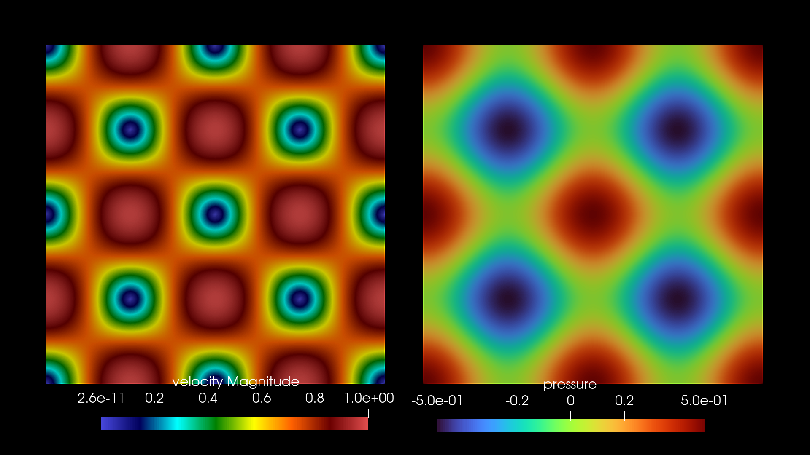
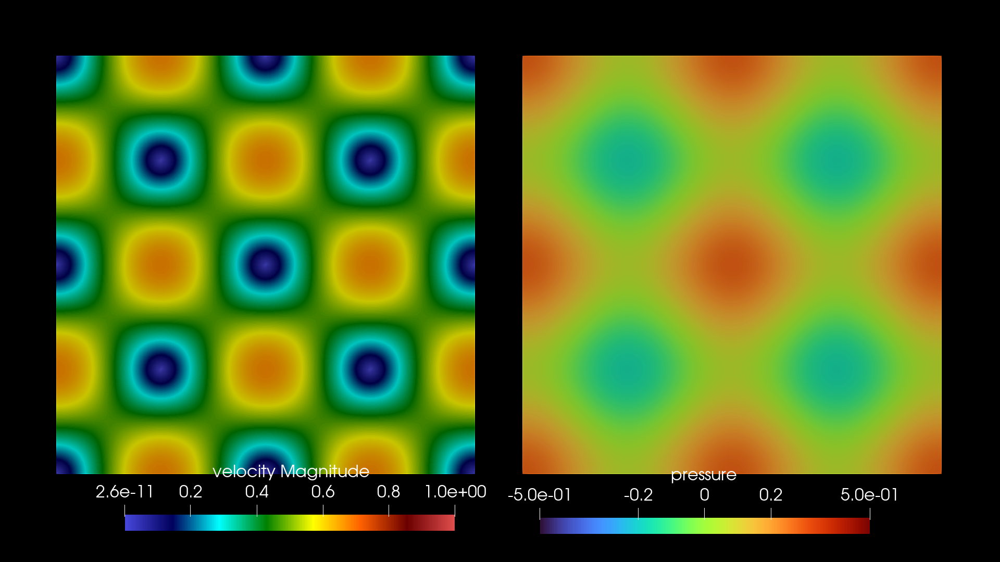
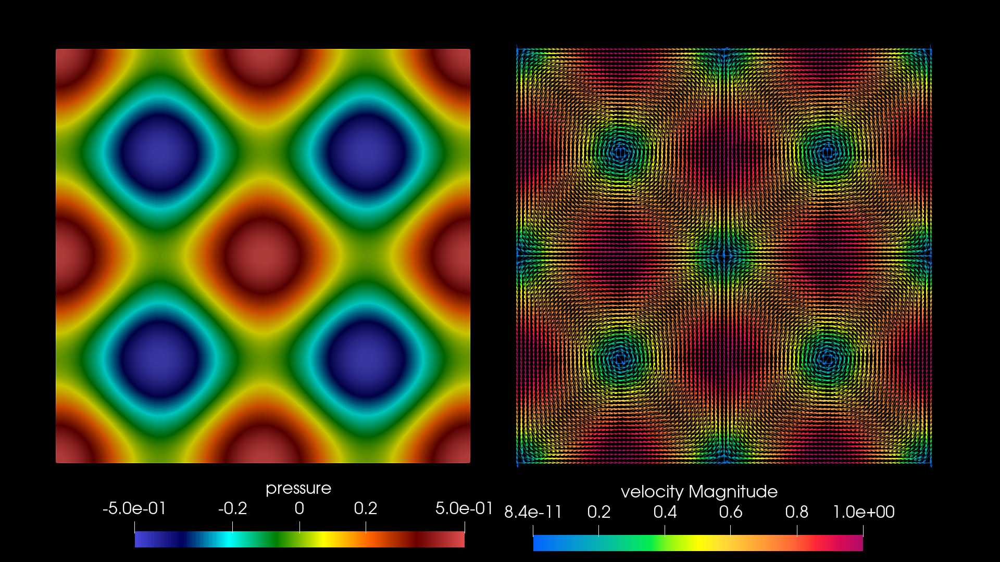

<script type="text/x-mathjax-config">MathJax.Hub.Config({tex2jax:{inlineMath:[['\$','\$'],['\\(','\\)']],processEscapes:true},CommonHTML: {matchFontHeight:false}});</script>
<script type="text/javascript" async src="https://cdnjs.cloudflare.com/ajax/libs/mathjax/2.7.1/MathJax.js?config=TeX-MML-AM_CHTML"></script>

# Taylor-Greenの流れとElmer入門

この記事は [LipersInSlums Advent Calendar 2023 スラム社会実装の理論と実践〜もうみんな苦しんでる。苦しんでないのはおまえだけ〜](https://adventar.org/calendars/9461) の10日目の記事です．（待降節第2主日．）

昨日の記事は「」でした．

- Elmer とはなにかの説明は省略する．詳しくは[公式Webページ](https://www.csc.fi/web/elmer)．
  - バージョンは9.0とする．
- 流体計算を例に Gmsh で構成した格子をもとに計算する．
  - バージョンは4.11.1．
- 対象：Elmerを使って有限要素法でいろいろな物理現象（偏微分方程式）を計算したい人．とりあえず何か1から動かしてみたい人．

> ここで，他書ではあまり触れられることのないTaylor-Green(1937)の流れ場について述べるのは，この流れ場の時間発展から，流れが単純で規則的な状態から乱流場へと展開していく初期の仮定を明確に理解できるからである．（日野幹雄著「乱流の科学 構造と制御」の288ページより．）

ここで述べるのはTaylor-Green(1937)の流れ場の”2次元版”である．本格的に知りたい方は3次元で乱流形成までの計算を実施することをおすすめする．今回はその入口の入口である（乱流みたいなら3次元で計算してね）．

広く知られているようにNavier-Stokes方程式を数値的に解くには多くの困難が伴う．本記事ではこの偏微分方程式の数値計算の妥当性まで追求しない．（DNSの困難さ．Verification and Validationの話．）

## 導入方法

環境は Ubuntu22.04 を想定する．インストール方法は以下の通り．

とりあえず以下を実行．

```
$ sudo apt-add-repository ppa:elmer-csc-ubuntu/elmer-csc-ppa
$ sudo apt-get update
```

ここで `apt search` すると2つ出てくる．公式ページでは `sudo apt-get install elmerfem-csc` を実行と書いてあるがそれはGUIが無いバージョンと書いてある．謎．

はじめはGUIが合ったほうが良いので `elmerfem-csc-eg` をインストールする．ただし本記事ではGUIは使わない．

```
$ sudo apt search elmer
Sorting... Done
Full Text Search... Done
elmerfem-csc/jammy 9.0-0ppa0-202312081417~bc715853c~ubuntu22.04.1 amd64
  Elmer FEM suite without ElmerGUI

elmerfem-csc-eg/jammy,now 9.0-0ppa0-202312081417~bc715853c~ubuntu22.04.1 amd64 [installed]
  Elmer FEM suite with ElmerGUI
...
```

次のコマンドを実行すればインストールされる．他に特別な操作は普通はいらないと思う．

```
$ sudo apt install elmerfem-csc-eg
```

### Gmsh のインストールと使い方

[Gmsh](http://gmsh.info/) をインストールする．使い方などはwebページにいろいろある．私が以前書いた記事は[こちら](https://qiita.com/i153/items/2422ea7d2a36e3476de3)．

## Taylor–Green vortex

Taylor–Green渦（以下ではTGVと略記する）を計算する．[Wikipediaの記事](https://en.wikipedia.org/wiki/Taylor%E2%80%93Green_vortex)を参考に2次元で計算することにする．

数値計算を行う領域 $\Omega$ は $(0, 2\pi)^2 \subset \mathbb{R}^2$ として，時刻を $t$ とし， $(x,y) \in \Omega$ なる流体の速度場の時間発展の $x$ 成分を $u(t,x,y)$ ， $y$ 成分を $v(t,x,y)$ とすると非圧縮性流体を仮定したNavier-Stokes方程式（以下NS方程式と略記）は以下の通りになる（導出は流体力学の教科書を参照）．ただし $\nu$ は正の定数であり動粘性係数と呼ばれる．また， $\rho$ は密度で正定数（非圧縮）である． $p$ 以下の3つの方程式から定まる量で圧力と呼ばれる．

$$
{\frac {\partial u}{\partial t}}+u{\frac {\partial u}{\partial x}}+v{\frac {\partial u}{\partial y}}=-{\frac {1}{\rho }}{\frac {\partial p}{\partial x}}+\nu \left({\frac {\partial ^{2}u}{\partial x^{2}}}+{\frac {\partial ^{2}u}{\partial y^{2}}}\right) \\
{\frac {\partial v}{\partial t}}+u{\frac {\partial v}{\partial x}}+v{\frac {\partial v}{\partial y}}=-{\frac {1}{\rho }}{\frac {\partial p}{\partial y}}+\nu \left({\frac {\partial ^{2}v}{\partial x^{2}}}+{\frac {\partial ^{2}v}{\partial y^{2}}}\right) \\
{\frac {\partial u}{\partial x}}+{\frac {\partial v}{\partial y}}=0
$$

TGVの計算のため，速度の初期値は，

$$
u(0,x,y)=\ \sin x\cos y \\
v(0,x,y)=-\cos x\sin y
$$

とした．また圧力の初期条件は，

$$
p={\frac {\rho }{4}}\left(\cos 2x+\cos 2y\right)
$$

とした．本来のTaylor-Green(1937)は3次元を想定している点に注意．

境界条件は領域 $\Omega$ の上下の辺を同一視，左右の辺を同一視することによる周期境界条件とした．

## 格子の用意

Gmshで領域 $\Omega$ を格子で分割する（メッシュを作るとも言う）． `.geo` ファイルは例えば等方的な格子（64分割）であれば以下の通りである．

```
// tgv mesh
pi = 3.14159265358979323846; // 円周率．
//+
Point(1) = {0, 0, 0, 1.0};
//+
Extrude {2*pi, 0, 0} {
  Point{1}; Layers {64}; Recombine; // 64分割．
}
//+
Extrude {0, 2*pi, 0} {
  Curve{1}; Layers {64}; Recombine; // 64分割．
}
//+
Physical Curve("wall") = {1, 2, 3, 4}; // あとでElmerの設定ファイルでwallの名前がついた境界の番号を指定する必要があるので必須．
//+
Physical Surface("fluid") = {5}; // 同様に領域についても適当な名前をつけておく．
```

このファイルを `tgv.geo` として以下を実行すれば格子が得られる．

```
$ gmsh -2 tgv.geo
```

出力される `tgv.msh` が格子ファイルである．

Elmer用に格子を生成する．以下を実行する（14はGmshファイルフォーマット，2はElmerSolverフォーマットである）．

```ElmerModelsManual.pdf 
$ ElmerGrid 14 2 tgv.msh
```

tgvという名前のディレクトリにElmer解析用の格子が出力されている．

## ElmerSolver の設定ファイルの構成

[公式ドキュメント](http://www.nic.funet.fi/pub/sci/physics/elmer/doc/)のElmerModelsManual.pdfを参照しながら設定していく．

Model 2にNavier-Stokes EquationsがあるのでこれをもとにElmerSolverで使う `.sif` ファイル（Elmerで使う設定ファイルの拡張子）を書く．詳しくは「ElmerSolver Manual」（上のリンクからPDFを取得できる）を見れば良い．

先に設定の他 `tvf.msh` の先頭数行をここに載せる．

```
$MeshFormat
4.1 0 8
$EndMeshFormat
$PhysicalNames
5
1 1 "left"
1 2 "right"
1 3 "top"
1 4 "bottom"
2 5 "fluid"
$EndPhysicalNames
$Entities
4 4 1 0
1 0 0 0 0
...以下略
```

次がsifファイルである．他で使ったsifファイルをテンプレにマニュアルとメッシュファイルを見ながら設定していけば良い．気をつけるポイントをコメントとして書いた．

```
$rho = 1.0   ! 密度
$nu = 0.0001 ! 動粘性係数

Header
  CHECK KEYWORDS Warn
  Mesh DB "." "tgv"
  Include Path ""
  Results Directory ""
End

Simulation
  Max Output Level = 5
  Coordinate System = Cartesian
  Coordinate Mapping(3) = 1 2 3

  Simulation Type = Transient ! 非定常計算．

  Steady State Max Iterations = 1

!  Serendipity P Elements = False ! Serendipity 要素を使うか．

  Output Intervals(1) = 1 ! 出力間隔．
  Timestep intervals(1) = 100000 ! 何ステップ計算するか．
  Timestep Sizes(1) = 0.05 ! 時間刻み幅．

  Timestepping Method = BDF ! 後退微分法．
  BDF Order = 2 ! 2次精度．

  Solver Input File = tgv.sif
  Post File = tgv.vtu ! vtu 出力．Paraviewで可視化する．
  Output File = "tgv.result" ! 再計算のためデータを残しておくか．
!  Restart File = "tgv.result" ! 上のファイルから再開できる．
!  Restart Position = 100 ! 何ステップ目から再開するか．

!  Set Dirichlet BCs by BC Numbering = True ! 境界条件の優先順位．物理量がnodeにある場合注意が必要．
End

Constants
End

Body 1
  Target Bodies(1) = 5 ! Gmshで生成したmshファイルの領域の番号と合わせる．この場合fluidにあたる領域番号．
  Equation = 1
  Material = 1
  Body Force = 1
  Initial condition = 1
End

Solver 1
  Equation = Navier-Stokes
  Procedure = "FlowSolve" "FlowSolver"

  Variable = Flow Solution[Velocity:2 Pressure:1]

  Exec Solver = Always

!  Bubbles in Global System = Logical True ! Bubble functionを使うか．
!  Element = "p:1" ! 何次要素を使うか．

  Stabilize = True ! FEMの安定化．
  Optimize Bandwidth = True ! 線形ソルバの最適化．

  Steady State Convergence Tolerance = 1.0e-5

  Nonlinear System Convergence Tolerance = 1.0e-8  ! ニュートン反復での収束判定．
  Nonlinear System Max Iterations = 20             ! そのままの意味．
  Nonlinear System Newton After Iterations = 3     ! ピカール反復を何回するか．
  Nonlinear System Relaxation Factor = 1           ! よく反復法関連で出てくる緩和係数みたいなやつ．
  Nonlinear System Newton After Tolerance = 1.0e-3 ! これ以下になったらニュートン反復する．

  Linear System Solver = Iterative                 ! 反復法で解く．小さい問題ならDirectでも良い．
  Linear System Symmetric = True                   ! NSから出てくる行列は対称ではないが既知の値を行列から除外したりゼロにして行列を対称化するか．
  Linear System Iterative Method = Bicgstabl       ! そのまま．

  BiCGStabl polynomial degree = 2                  ! そのままの意味．以下略．

  Linear System Max Iterations = 500
  Linear System Convergence Tolerance = 1.0e-10
  Linear System Residual Output = 10               ! 残差を何回に1回出力するか。
  Linear System Preconditioning = ILU3             ! 前処理にILU(3)法を使用する．
End

Equation 1
  Active Solvers(1) = 1
End

Material 1
  Compressibility Model = Incompressible ! 非圧縮．
  Viscosity = $nu
  Density = $rho
End

Body Force 1
End

Initial Condition 1
  Pressure = Variable coordinate 1, coordinate 2
    Real MATC "0.25 * rho * (cos(2.0*tx(0)) + cos(2.0*tx(1)))"
  Velocity 1 = Variable coordinate 1, coordinate 2
    Real MATC "sin(tx(0))*cos(tx(1))"
  Velocity 2 = Variable coordinate 1, coordinate 2
    Real MATC "-cos(tx(0))*sin(tx(1))"
End

Boundary Condition 1
  Target Boundaries(1) = 1 ! 重要！ここの1が.mshファイルのleftにあたる1と対応している必要がある．
  Periodic BC = 2
  Periodic BC Pressure = Logical True
  Periodic BC Velocity 1 = Logical True
  Periodic BC Velocity 2 = Logical True
End

Boundary Condition 2
  Target Boundaries(1) = 2 ! rightとの対応関係．
End

Boundary Condition 3
  Target Boundaries(1) = 3 ! topと対応．
  Periodic BC = 4
  Periodic BC Pressure = Logical True
  Periodic BC Velocity 1 = Logical True
  Periodic BC Velocity 2 = Logical True
End

Boundary Condition 4
  Target Boundaries(1) = 4 ! bottomと対応．
End
```

実行は `ElmerSolver` と打つか以下のようにsifファイルを明示しても動く．

```
$ ElmerSolver tgv.sif
```

## 数値計算結果

密度を1.0，動粘性係数を0．01とした．[Paraview](https://www.paraview.org/)で可視化した結果を載せる．

$t = 0.05$ の速度の大きさと圧力場．



$t = 20.0$ の速度の大きさと圧力場．



粘性による散逸が起こっている．また対称性も数値誤差で崩れずに保持されている．

### 動粘性係数が0.0001の結果

数値計算としてはこの動粘性係数で解けているとは言えないだろう．それっぽさの提供．

計算に用いた設定ファイルとメッシュは以下のとおりである．

commit: `https://github.com/mino2357/Elmer-expt/commit/dcec63f16cd7c58a77f6706d23c760fa6cde8862`

Youtube動画への[リンク](https://youtu.be/HycEdr3vN-g)．

[](https://youtu.be/HycEdr3vN-g)

圧力が振動しているように見える．

35秒あたりで対称性が崩れて渦が移動し始める．これはもちろん数値誤差が要因である．

最後の方は本当にそうなるかなという疑問がある．

## 参考

- GitHub: [Elmer数値解析実験場](https://github.com/mino2357/Elmer-expt)
  - [OpenFOAMとの比較](https://github.com/mino2357/Elmer-expt/tree/main/2d-flow-verification)．
- 日野幹雄著[「乱流の科学 構造と制御」](https://www.asakura.co.jp/detail.php?book_code=20161)
  - とても詳しくTGVも書いてあります．
- [Case C3.3: Taylor-Green vortex](https://www1.grc.nasa.gov/wp-content/uploads/C3.3_Twente.pdf)
  - ベンチマーク問題．NASA．
- [NUMERICAL SIMULATION OF TAYLOR–GREEN VORTEX DECAY IN LAMINAR AND TURBULENT REGIMES](https://sv-journal.org/2014-2/01/en/index.php?lang=en)
- 大木谷耕司, 数理解析研究所講究録 974巻 1996年 216-229, ["Taylor-Green 渦のエンストロフイーの逐次近似"](https://www.kurims.kyoto-u.ac.jp/~kyodo/kokyuroku/contents/pdf/0974-21.pdf)
  - 具体的に計算できるのは面白いと思う．

## 感想

半日で昔から存在は知っていたが計算した経験がないTGVを計算してみた．問題設定が簡潔なため自作コードでも動かしやすいし，OpenFOAMなどのほかソルバで計算して見るのも面白いだろう．乱流モデルなどのベンチマークにもなるだろう．

突貫作業だったのでも記述が不十分な点もあるだろう．もう少し踏み込んでやりたかった．運動エネルギーの時間変化とか．やはり3次元計算してエネルギースペクトル見るぐらいまではやってみたいし，やってみてほしい．これの続きをどこかでやるかもしれない．

3次元で計算してこその乱流なのでいろいろ文献見ながらぜひやってみてくださいね．

あとElmerはいろいろな流体に限らずいろいろな物理現象を扱えるのでModelsManualを読みながら計算すると楽しいですよ．

明日は赤熊🐻👑🦑🐍さんの「[Python 3 への移行を見据えた Python 2.7 コードの書き方](https://scrapbox.io/akagma/Python_3_%E3%81%B8%E3%81%AE%E7%A7%BB%E8%A1%8C%E3%82%92%E8%A6%8B%E6%8D%AE%E3%81%88%E3%81%9F_Python_2.7_%E3%82%B3%E3%83%BC%E3%83%89%E3%81%AE%E6%9B%B8%E3%81%8D%E6%96%B9)」です．

紅茶を飲むの再開しようかな〜．

最後まで読んでいただきありがとうございました．

[トップページへ](../index.md)