

# 2023年岐阜の旅

この記事は [LipersInSlums Advent Calendar 2023 スラム社会実装の理論と実践〜もうみんな苦しんでる。苦しんでないのはおまえだけ〜](https://adventar.org/calendars/9461) の17日目の記事です．（待降節第3主日．）

昨日の記事はskht777さんの「」でした．

## 金華山篇

2023年の初夏．3日ほど岐阜市の某ホテルを拠点に岐阜を見てまわった．

初夏の岐阜らしい暑さだった．時代劇に出てきそうな通りは昔見たときと変わらずあった．

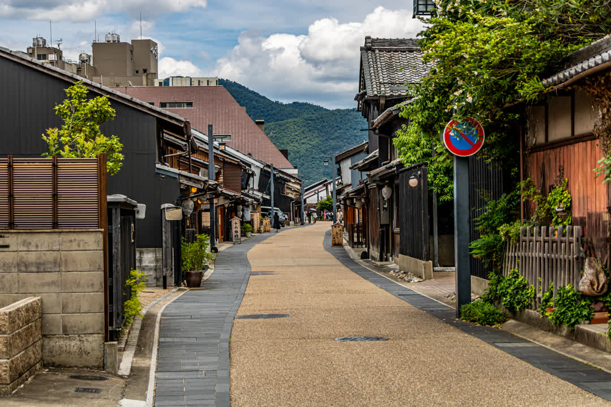

金華山を散策した．山と言っても登ってはいない．ロープウェイで山頂付近まで数分．標高329mらしい．山頂には岐阜城（旧稲葉山城）がある．

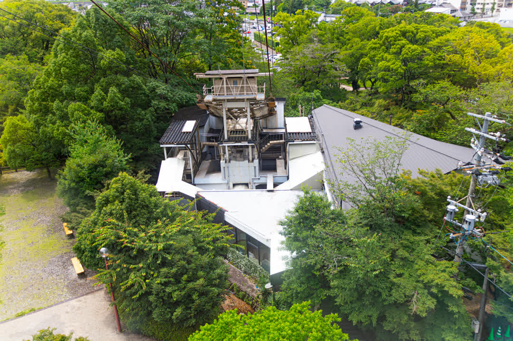

気圧の変化で耳がツーンとなった．降りればすぐに岐阜城があるかとそうではなく息が上がるぐらいには登った．ただの運動不足である．

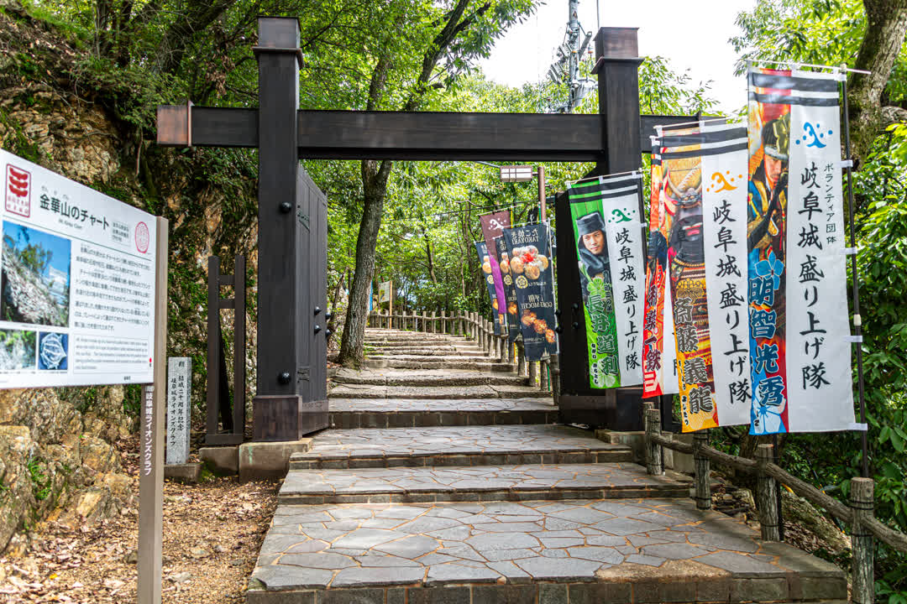

途中の地層？みたいな縞々の岩があって興味深かった．

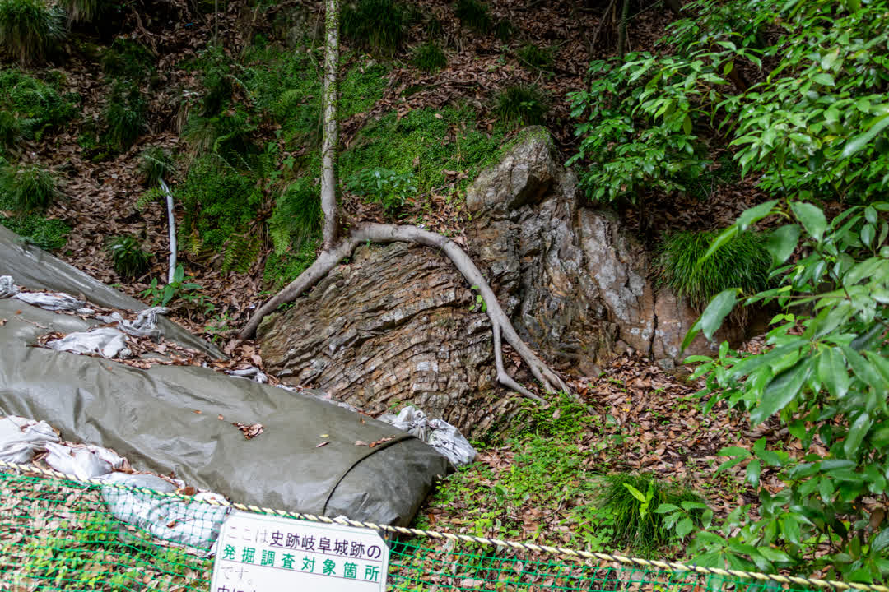

ロープウェイから歩くこと10分と少し．岐阜城がすぐそばに見えた．

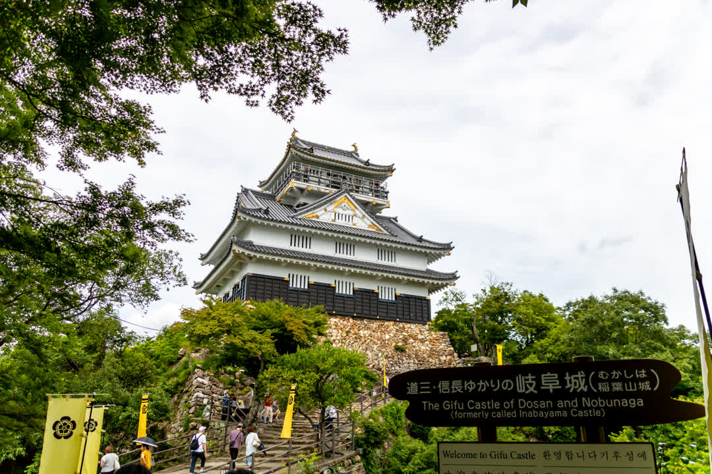

よく山の頂上まで岩や建築のための資材を持ってきたなと思った．

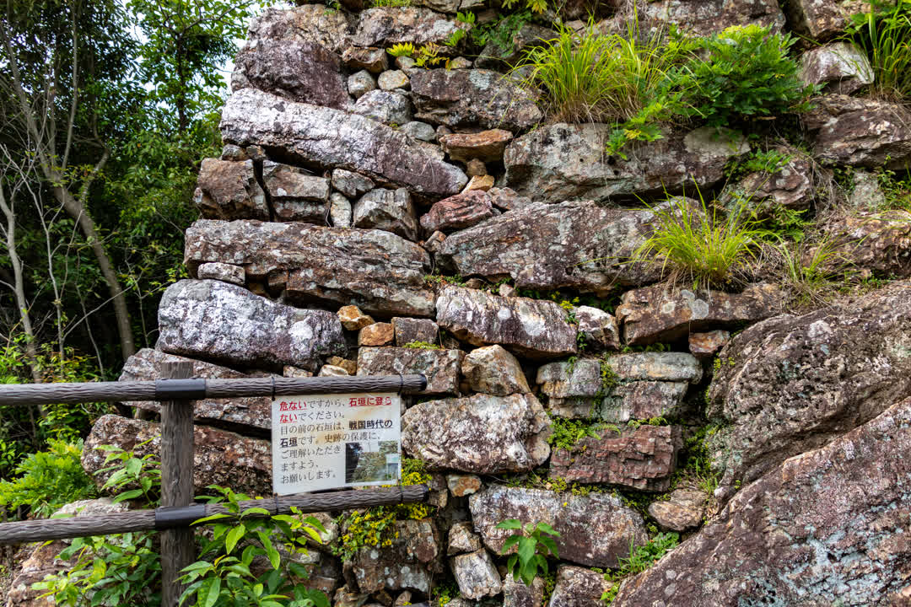

岐阜城の中は再建もあったため資料館のようになっており一通り来歴を知ることができた．最上階は展望台となっており，岐阜の町並み，遠くは名古屋のビル群であろうところまで一望できた．

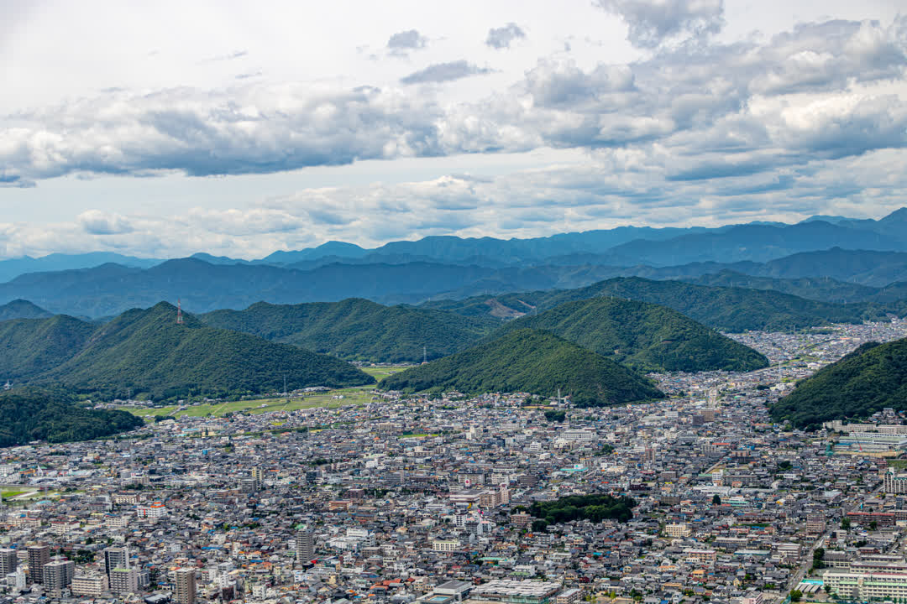

たくさんの山なのか丘なのかわからない地形の起伏があった．その上を通過する空気の流れを想像した．雰囲気脳内CFD．

山頂付近にはリス村があって身近に触れ合える．

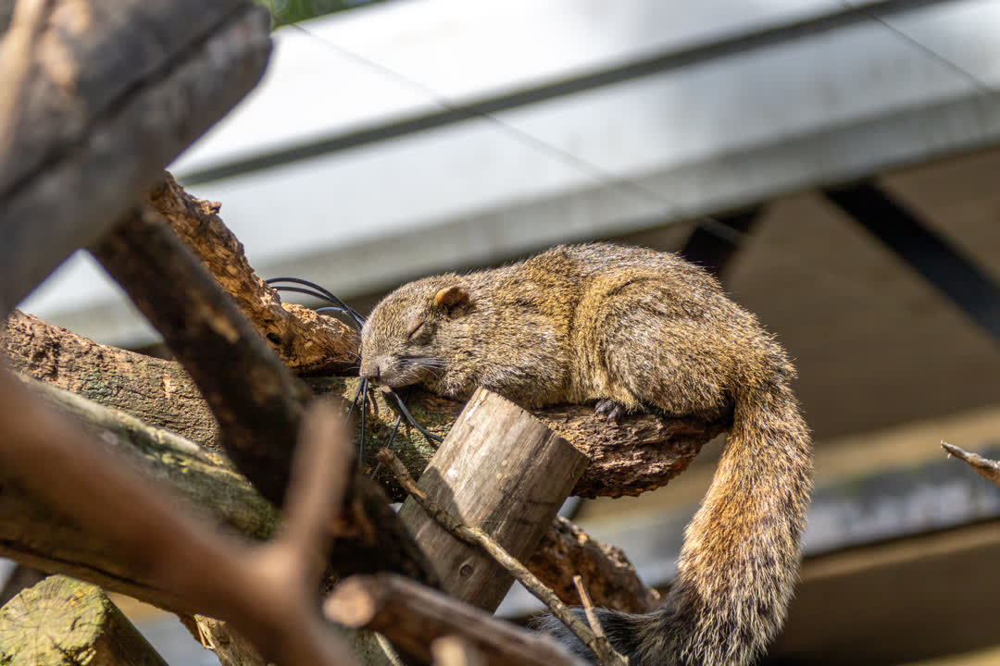

地べたで休んでいるのか，気持ち良さそう．

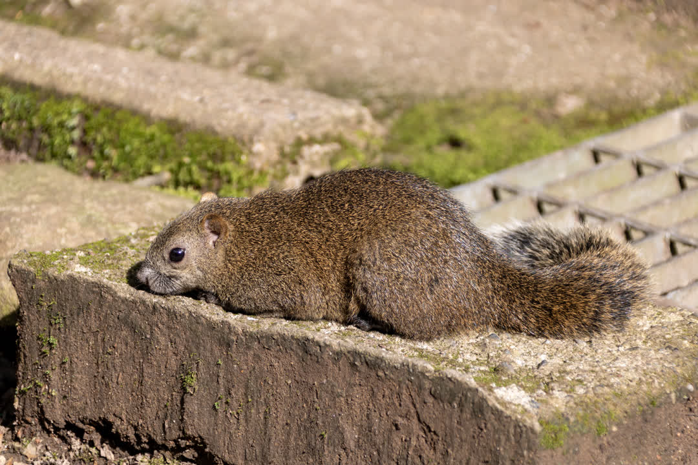

木の上で寝ているのか日向ぼっこしているリスも可愛かった．

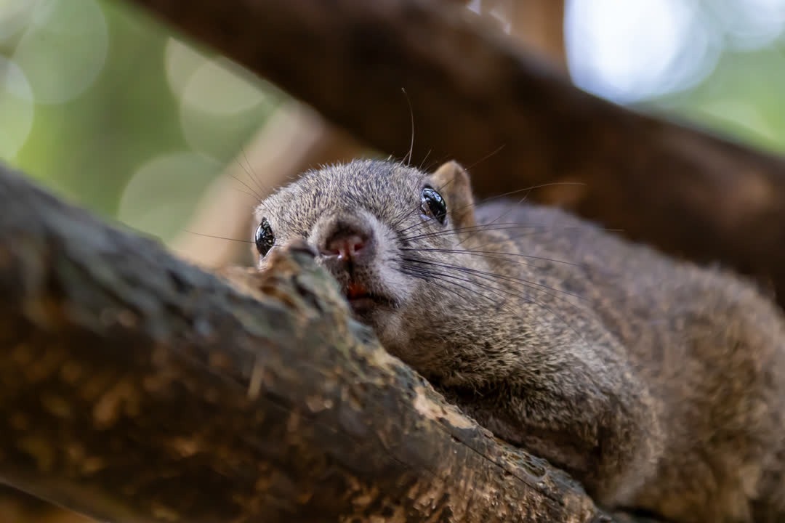

帰りもロープウェイ．三重の塔があることを知った．

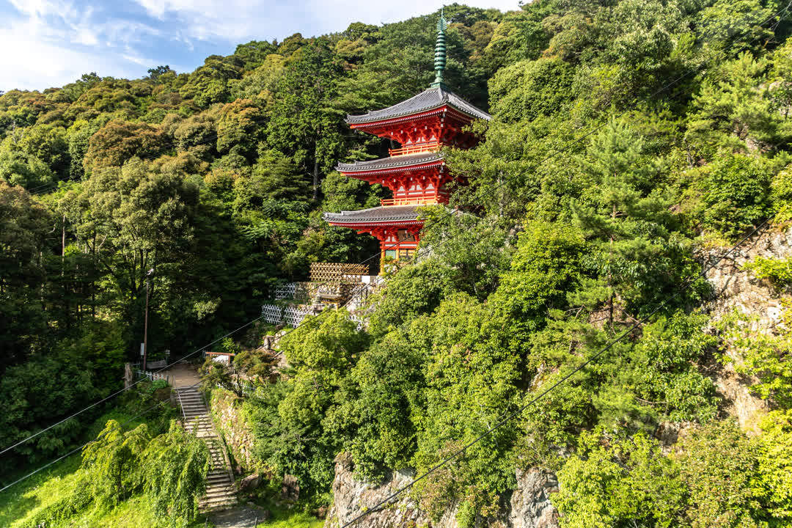

小さい滝．

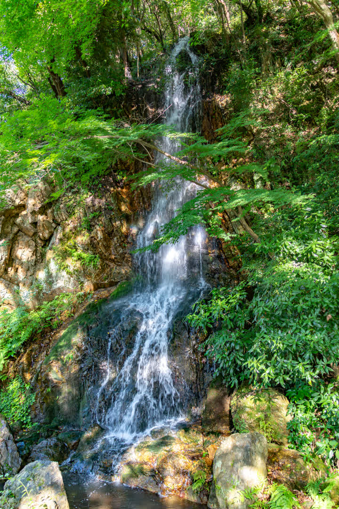

一旦ホテルで休んで夜に長良川の川岸を歩いた．少し気温が下がった夜中にかがやく鵜飼の炎は幻想的だった．

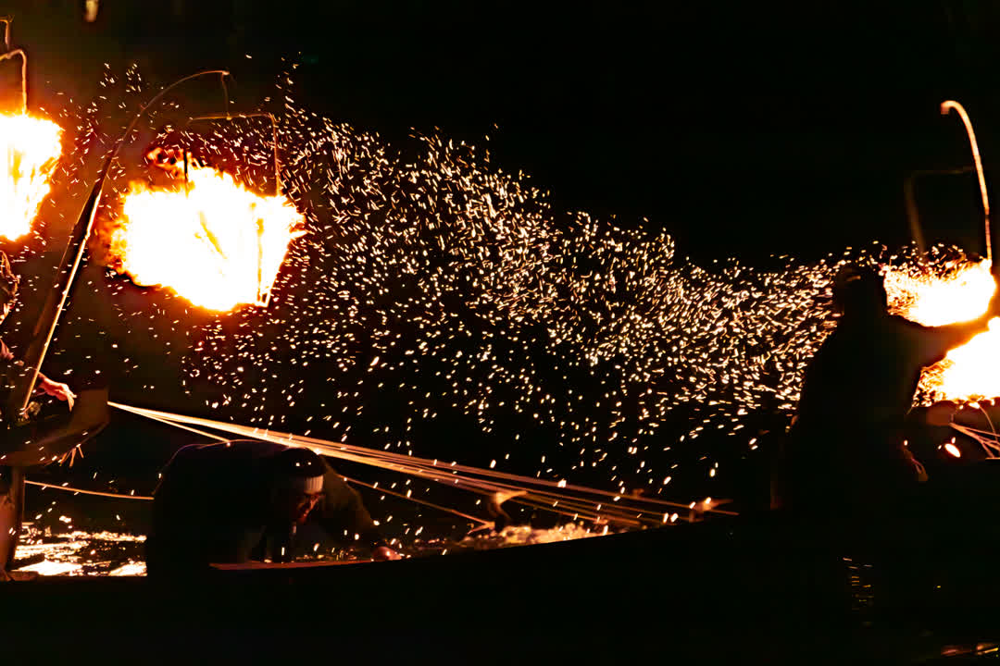

最後まで読んでいただきありがとうございました．

明日はhsjoihsさんの「」です．

[トップページへ](../index.md)