<script type="text/x-mathjax-config">MathJax.Hub.Config({tex2jax:{inlineMath:[['\$','\$'],['\\(','\\)']],processEscapes:true},CommonHTML: {matchFontHeight:false}});</script>
<script type="text/javascript" async src="https://cdnjs.cloudflare.com/ajax/libs/mathjax/2.7.1/MathJax.js?config=TeX-MML-AM_CHTML"></script>

# 太陽系の長時間の軌道計算

キーワード：
- 太陽系の安定性．
- 惑星の離心率の変化．
- ICRFによる座標系を採用．
  - 結果は太陽を中心とする相対座標．
- 1.0Myearの計算．
- ERKにより8次精度の数値計算．
- 倍精度による演算．

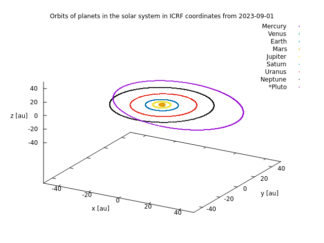

todo!グラフの色が分かりづらく工夫が必要．白黒でもわかるように．

## 実験のレポジトリとコミットハッシュ

GitHub：https://github.com/mino2357/N-body-Scrapbox
- https://github.com/mino2357/N-body-Scrapbox/commit/fec92b8be99005f11d2b1abfc7b7e9887f0b5e16

commit: `fec92b8be99005f11d2b1abfc7b7e9887f0b5e16`

## 計算に用いたモデル

ニュートン力学に基づく運動方程式を使用した．（最近は相対論に基づいた1PN近似等での計算が行われている．2015, RICHARD E. ZEEBE. など．）

$$
\frac{d^2 \boldsymbol{x}_{i}}{dt^2} = G \sum_{j(\neq i)}^{N} \frac{m_{j}}{||\boldsymbol{r}_{ij}||^3}\boldsymbol{r}_{ij}
$$

数値計算の精度のためにも無次元化方程式を使用した．Ref. [無次元化について](n-body-eq.md)．

## 初期条件

`Horizons On-line Ephemeris System v4.97` から初期条件を取得した．座標系はICRF．太陽を中心とした各惑星の相対速度を以下として取得した．

参考：[取得方法](use_HorizonsOn-lineEphemerisSystem.md)．

### 2023-09-01-00:00:0000 の位置と速度

水星

```
X = 4.749853696679540E+07 Y =-3.737724061730301E+07 Z =-7.411266476235436E+06
VX= 1.772352879533610E+06 VY= 3.503420726740979E+06 VZ= 1.237342409601002E+05
```

金星

```
X = 1.067832390650615E+08 Y =-1.974951870317106E+07 Z =-6.432625455056737E+06
VX= 5.355688919820316E+05 VY= 2.961698410495598E+06 VZ= 9.767588002410719E+03
```

地球

```
X = 1.400066731258702E+08 Y =-5.656864340673850E+07 Z = 2.358117319162935E+03
VX= 9.220286795888582E+05 VY= 2.375474361150964E+06 VZ=-2.180159483080331E+02
```

火星

```
X =-2.317149312291399E+08 Y =-7.301765439010516E+07 Z = 4.153589884319007E+06
VX= 7.072649115996205E+05 VY=-1.817932890099840E+06 VZ=-5.544867514259787E+04
```

木星

```
6.125858099714541E+08 Y = 4.198544407080007E+08 Z =-1.544953710371283E+07
VX=-6.520016889714854E+05 VY= 9.852604412872446E+05 VZ= 1.049049729723986E+04
```

土星

```
X = 1.309454381823805E+09 Y =-6.485533471689560E+08 Z =-4.083518400133377E+07
VX= 3.236801726147626E+05 VY= 7.473526635600305E+05 VZ=-2.592763479803463E+04
```

天王星

```
X = 1.891786630777107E+09 Y = 2.246534492281295E+09 Z =-1.618145404476953E+07
VX=-4.550220547965139E+05 VY= 3.526668388808242E+05 VZ= 7.193044943207628E+03
```

海王星

```
X = 4.461097261292484E+09 Y =-3.255589171394691E+08 Z =-9.610267007640028E+07
VX= 3.057160253033973E+04 VY= 4.723624786308346E+05 VZ=-1.040664801597096E+04
```

冥王星（準惑星であるが今回の計算に含めた．）

```
X = 2.523199306620363E+09 Y =-4.554189299791788E+09 Z =-2.421678207220302E+08
VX= 4.215862004260509E+05 VY= 1.243989357680785E+05 VZ=-1.368765412288774E+05
```

## 数値積分方法

太陽系のような安定した系ではシンプレクティック積分法が適しているが本計算では埋め込み型ルンゲ・クッタ法を使用した．

局所離散差誤差が時間刻み幅の8次精度と9次精度のものを使い，誤差の推定を行い更新には9次精度のものを使用した．大域誤差は8次精度である．

公転周期の短い水星によってほぼ時間刻み幅が決まるので時間刻み幅の上限をそれに応じた経験的なものにした，それ以下は自動時間刻みで積分するようにした．

## 数値計算の結果

約100万年に渡って積分した．

惑星の離心率の変化．

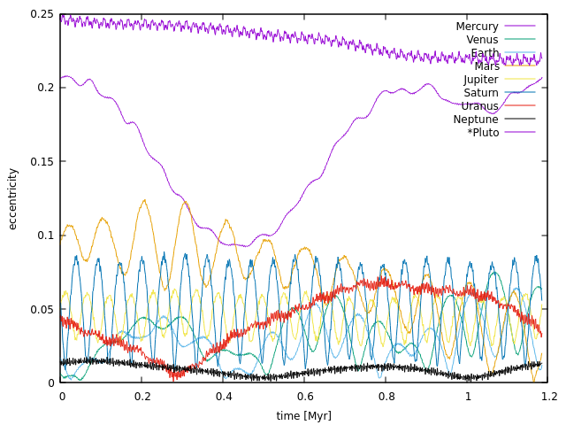

地球型惑星の離心率の変化．

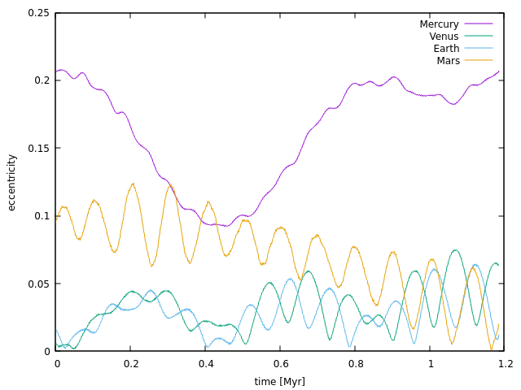

解像度の高いもの．

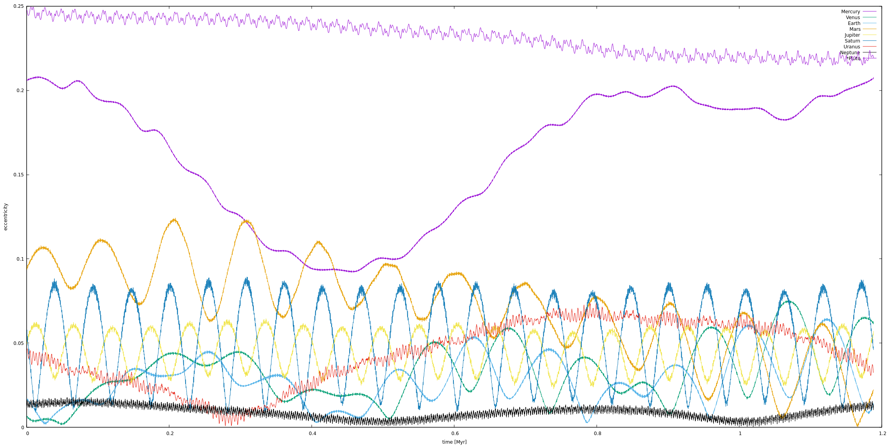

1Myr付近の離心率．

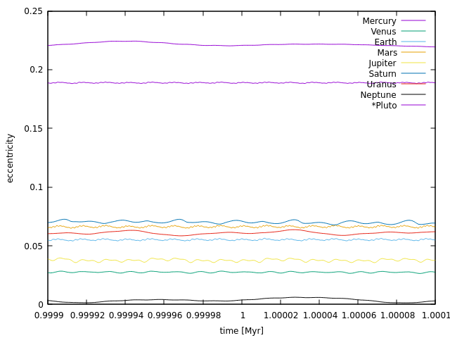

## 数値誤差

ルンゲ・クッタ法である以上誤差が発生する．重力ポテンシャル上での相互作用なので第1積分がいくつかあるが，全ては見ずに実装が簡単だったので第1積分のひとつである角運動量を見た．以下のとおりであった．

単位系は長さが天文単位，時間が1dayを基本単位とするICRF座標系での値である．

Lx, Ly, Lz, Lの大きさの順である．

`t=0.0000001591549431` （年）での角運動量．

```
0.0000929625844997 0.0000295042676406 0.0035381860512656 0.0035395300644714
```

`t=1355418.4653501429129392` （年）での角運動量．

```
0.0000929625847565 0.0000295042676995 0.0035381860797420 0.0035395300929442
```

角運動量の大きさは誤差の影響で2.84728e-11増加した．相対誤差は8.04423174e-9であった．

相対誤差の時間変化は以下のグラフのとおりであった．長時間の計算であったが意外にも小さく抑えられた．

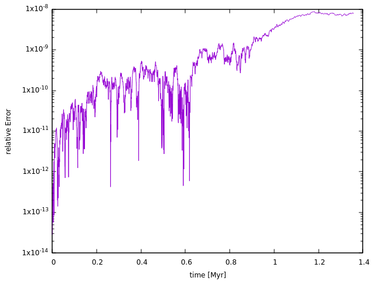

## 120万年の軌道

冥王星を含めた1Myrの軌道（ICRF座標で太陽を原点に置いたときの相対座標）．データをかなり間引いて（数千年）プロットしているので軌道の変化がよくわかる．

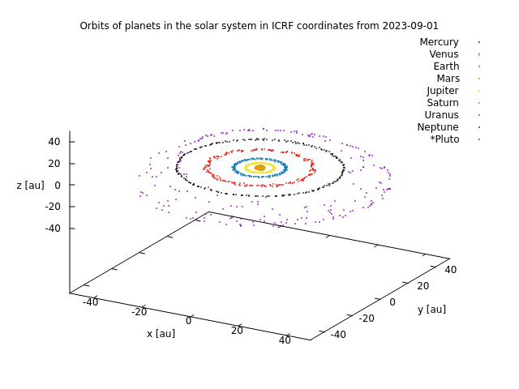

地球型惑星．（z軸の範囲に注意．）

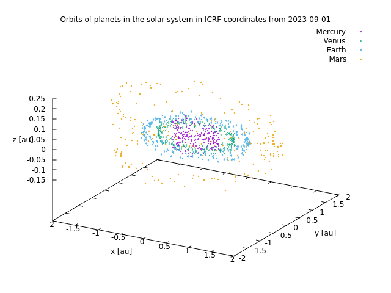

## はじめの600年の軌道

冥王星を含めた惑星．（z軸の範囲に注意．）

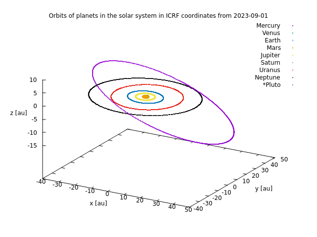

地球型惑星．z軸の範囲を0.06auまで縮めると軌道傾斜角がよくわかる．

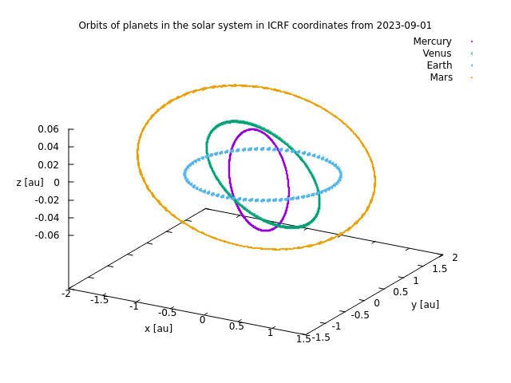

## 先行研究との比較

2017, Tabar´e Gallardo. のp.5の図と離心率の図がほぼ一致している．p.6の木星と土星の離心率の相互作用（？）の図は私が得た結果とほぼ一致している（下図）．なぜこのような相関があるのかは私はわかっていない．

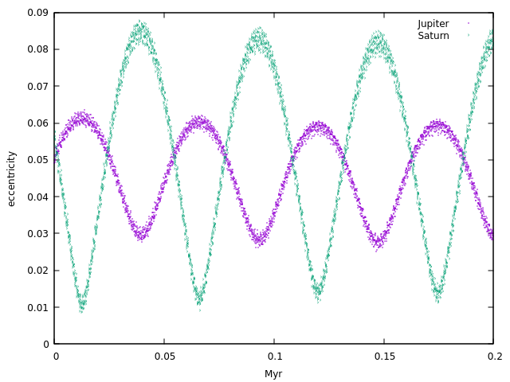

離心率の時間変化など初期値が明らかに異なる（2023年9月1日0時0分0秒）データから"European Journal of Physics"に載るレベルの論文の結果とほぼ同じもの（画像なので定量的な比較が出来ない）が得られたのである程度の信頼性のある結果は得られたと思われる．

## その他

4GBの位置，速度，離心率ベクトルなどログデータがあり，データ処理中．いろいろな相関は見られると思う．軌道共鳴など．

この分野は初心者なので勉強が必要．

## 参考文献

1. [The orbital evolution of the Sun–Jupiter–Saturn–Uranus–Neptune system on long time scales](https://www.researchgate.net/publication/343911430_The_orbital_evolution_of_the_Sun-Jupiter-Saturn-Uranus-Neptune_system_on_long_time_scales)
2. [HIGHLY STABLE EVOLUTION OF EARTHʼS FUTURE ORBIT DESPITE CHAOTIC BEHAVIOR OF THE
SOLAR SYSTEM](https://www.soest.hawaii.edu/oceanography/faculty/zeebe_files/Publications/ZeebeApJ15E.pdf)
3. [Exploring the orbital evolution of planetary systems](http://www.astronomia.edu.uy/orbe/ExploringTGallardo.pdf)
4. [Stability of the solar system](http://www.scholarpedia.org/article/Stability_of_the_solar_system) 

他読んでいて面白い論文があったのでまたの機会にまとめておく．


[トップページへ](../index.md)
