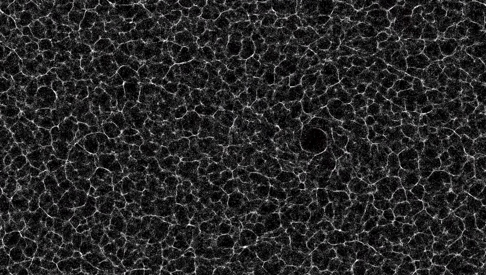

# 短い自己紹介

数理科学関連好き．中学生の頃から数学をほぼ毎日やっている人間．数値計算屋さん．

# 数値計算関連

- [N次元ユークリッド空間上の波動方程式](https://github.com/mino2357/wave_equation_difference_between_3d_and_4d)はNが奇数か偶数で挙動が変わる．
- [重力多体問題](https://github.com/mino2357/N-body-Scrapbox)
  - [基礎方程式，計算の際の無次元化](docs/n-body-eq.md)
  - [天体の位置の調べ方, Horizons On-line Ephemeris Systemの使い方メモ](docs/use_HorizonsOn-lineEphemerisSystem.md)
  - [太陽系の長時間の軌道計算](docs/sol-system.md)
- [補間に関する数値実験](https://github.com/mino2357/interpolation-in-regression)
  - 偏微分方程式の数値計算用に書いているもの．統計の非線形（重）回帰分析とかでも使えると思う．まだ100倍程度は速く計算できると思っている．関数は多項式でやっているが他の関数でも出来るだろう．
- [近傍探索計算](https://github.com/mino2357/nearest_neighbor_search)
  - kd-treeの実装．例としてレナード・ジョーンズ型のポテンシャルで点群の敷き詰めをやっている．複雑領域での数値計算に使えるのではないかと思っている．近距離相互作用なら高速化が出来るだろう．重力多体問題への応用は難しいだろう．Barnes & Hut (1986) が考案したものが良いだろう．
- [熱方程式（拡散方程式とも言う）の数値計算法．](docs/pdf_files/Heat_equation.pdf) (PDF)
  - 数値計算の入門時代に書かれたもの．

# Advent Calendar ネタ
- [Taylor-Greenの流れとElmer入門](docs/advent_elmer.md)
- [岐阜観光2023．金華山．](docs/advent_gifu2023.md)

# 数値計算の可視化

- [重力多体問題](/docs/visualization-gravity-01.md)

# 数学雑記とメモ帳

- [補間と回帰](docs/interp-01.md)
- [残っている最古のPDF文書](docs/pdf_files/dmath.pdf) (PDF)

## 私について

2019年から民間で主に数値計算法の研究，開発．レースエンジニアリング支援．数値流体力学．電磁場解析．弾塑性解析．数理モデルの構築．さまざまな最適化問題の定式化，高速化．大規模計算のサーバ管理．ジョブスケジューラの導入，保守．基本的に数学や物理を毎日のように使うお仕事をしています．

researchmap: [Takaaki MINOMO](https://researchmap.jp/t_minomo/?lang=japanese)

ルター派のゆるふわクリスチャン．パニック障害とうつ病とともに生きる．人混みが苦手．

## 趣味

- ピアノを弾きます．バッハが特に好きです．
- 読書．
- 星景，天体写真．
- モータースポーツ．
- 思いついた効率的だったり高精度な数値計算法を実装して確かめること．
- 数理モデルの構築，実装．
- 流体計算．
- 最近よく読んでいる本の分野．
  - 複素多様体．表現論．D-加群．

### List of my poster presentations.
「Mathematical model of the cell population movement」，第18回ソウル大ジョイントシンポジウム, 2015/11/27, 場所：ソウル大学． Abstract

Traveling pulse solutions in a point mass model of diffusing particles, The 17th RIES-Hokudai International Symposium “Jyuu” (Poster Presentation), CHÂTERAISÉ Gateaux Kingdom Sapporo, (Sapporo, Japan), December 13th-14th, 2016, ○ Takaaki Minomo , Masaharu Nagayama，Elliott Ginder.

### List of my presentations.
応用数理研究会（2016年8月24～27日，千里浜．口頭発表）

国際研究会（2016年9月4～9月12日，Czech-Japanese- Polish Seminar in Applied Mathematics 2016，Poland, AGH University of Science and Technology，口頭発表）

Traveling pulse solutions in a point mass model of diffusing particles ，応用数学合同研究集会（日本数学会応用数学分科会主催），龍谷大学（滋賀県・大津市），2016年12月15日〜17日，○簑毛崇章（北海道大学），長山雅晴，Elliott Ginder

### Papers.
Traveling pulse solutions in a point mass model of diffusing particles
Elliott Ginder, Takaaki Minomo, Masaharu Nagayama, Satoshi Nakata, Hiroya Yamamoto Computer Methods in Materials Science 17(2) 111-121 2017年12月 [査読有り]
